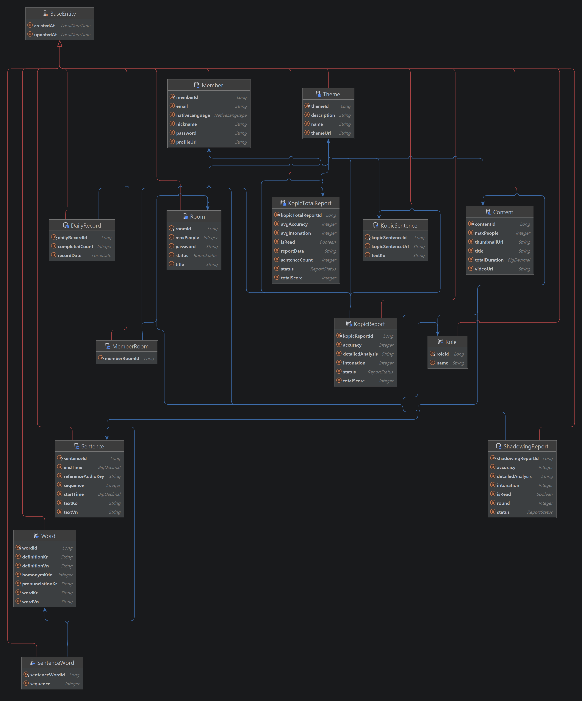

 
 

 
 

> # MEARI (메아리)
> ### 숏폼 콘텐츠 기반 그룹 쉐도잉 종합 플랫폼
>**MEARI**는 이주민을 위한 한국어 말하기 연습 플랫폼입니다.  
> 생생한 표현이 담긴 컨텐츠를 친구들과 함께 연기하며 학습하는  
> 즐거운 학습경험을 제공합니다.

 
 

---

## 📆 목차

  

**[프로젝트 개요](#프로젝트-개요)**

**[주요 기능](#주요-기능)**

**[기술 스택](#-기술-스택)**

**[시스템 아키텍처](#시스템-아키텍처)**

**[ERD](#ERD)**

 
  
 

---

## 👥 팀 구성
 

| 이름  | 역할              | 담당 기능                               | GitHub                                              |
|-----|-----------------|-------------------------------------|-----------------------------------------------------|
| 김선엽 | Frontend        | 프로젝트 리드, 대시보드 및 메인 기능 기획 · 개발       | [@shipleaf](https://github.com/shipleaf)            |
| 국민혁 | Frontend        | 인증, 메인 기능 기획 · 개발                   | [@meanhg](https://github.com/meanhg)                |
| 전석균 | Backend / AI / Infra | CI/CD 및 인프라, AI 음성 분석 로직, WebSocket 기능 기획 · 개발 | [@jsg9987](https://github.com/jsg9987)              |
| 김희수 | Backend         | 인증/회원, WebSocket 기능 기획 · 개발         | [@kayaaaaaaaaaaa](https://github.com/kayaaaaaaaaaaa) |
| 하은지 | AI              | 데이터 관리, 음성 분석 모델 파인튜닝               | [@EunByu1](https://github.com/EunByu1)                     |
| 장상민 | Infra / Backend | CI/CD 및 인프라, WebRTC 기능 기획 · 개발            | [@thermoCat](https://github.com/thermoCat)          |

 
  
 

---

## 📄 프로젝트 개요
 

**MEARI**는 이주민을 위한 한국어 말하기 연습 플랫폼입니다.

**필요에 따라 선택하는 다양한 AI 숏폼 드라마**,  
**WebRTC 기반 실시간 그룹 쉐도잉**,  
**다양한 상황에 대처하는 KOPIC**,  
**AI 음성 분석을 통한 학습 리포트**,  
**지속적인 학습을 유도하는 일일학습** 

생생한 표현이 담긴 컨텐츠를 보고 친구들과 함께 연기하며 학습하는  
즐거운 학습경험을 제공합니다. 

 
 

 
 

### **1. 최대 4인 역할 기반 동시 쉐도잉으로 실제 상황 시뮬레이션**
  - 다인 간 대화 영상을 기반으로 상황과 맥락, 뉘앙스까지 학습
  - 실생활 기반 컨텐츠 구성으로, 나의 환경과 필요에 맞는 컨텐츠를 선택하여 학습

   

### **2. 시간과 장소에 구애받지 않는 원격 그룹 학습**
  - 거주 국가, 지역, 시간에 관계 없이 원할 때 언제나 학습을 시작할 수 있는 실시간 스터디룸
  - 화상통화와 실시간 채팅으로,  원활한 의사소통 가능

   

### **3. 주어진 상황에 대한 언어적 대처능력 평가 및 학습 서비스 코픽**
- 상황에 따른 문맥과 뉘앙스, 표현적 적절성을 평가하고, 개선점을 도출

   

### **4. AI 기반 발음, 억양, 정확도, 내용 적절성 피드백 리포트**
  - 기능적, 내용적 피드백을 제공하는 쉐도잉 리포트와 코픽 리포트

   

### **5. 어휘와 문법을 보충해주는 일일학습 과제**
  - 발화의 기반이 되는 문법과 어휘의 꾸준한 학습 독려

   

### **6. 기간별 학습통계를 나타내는 대시보드**
  - 일별 학습 기록 통합 통합 조회로 성장 과정 확인

 
  
 

---

## 🛠️ 기술 스택
 

### ⚙️ Backend

### 🗄️ Database & Infrastructure

### 🔐 인증 & 보안

### 🧠 AI & 미디어

### 🖥️ Frontend

### 🔁 테스트 & 문서화

### 🔧 Environment

### 💬 Communication

   

 
 

---

## 💡 주요 기능
 

### 1. 회원 가입 및 인증
- JWT 기반 인증 시스템 (Access Token + Refresh Token)
- Spring Security를 통한 안전한 회원 관리
- Redis 세션 관리 및 PostgreSQL 데이터 저장

### 2. 실시간 협력 학습 (그룹 섀도잉)
- OpenVidu 2.30.0 기반 WebRTC 최대 4인 화상 통화
- STOMP WebSocket으로 실시간 역할 선택, 준비 상태, 채팅 동기화
- 라운드별 녹화 및 게임 진행 상태 관리 (WAITING → WATCHING → ROLE_PICK → ROUND_1 → ROUND_2)
- 테마별 방 생성 및 빠른 입장 (공개방/비밀방)
- FFmpeg를 이용한 동영상 처리 및 AWS S3 저장

### 3. 혼자 연습 모드
- 다른 사람 없이 혼자서 섀도잉 연습 가능
- 원하는 콘텐츠와 역할 자유 선택
- 라운드별 녹음 및 음성 분석 요청

### 4. 섀도잉 콘텐츠 관리
- 테마별 콘텐츠 관리 (드라마, 영화 등 실생활 기반)
- 문장 단위 학습: 한국어/베트남어 번역, 타이밍 정보, 역할(Role) 할당
- 최대 4개 역할 지원

### 5. AI 기반 음성 분석 (비동기)
- RabbitMQ 기반 비동기 처리 (Producer/Consumer 패턴)
- FastAPI + Wav2Vec2 기반 발음 정확도 분석 (0~100점)
- Parselmouth + DTW 기반 억양 유사도 분석 (0~100점)
- 음절 단위 상세 피드백 (오류 위치, 유형, 신뢰도)
- S3 자동 오디오 다운로드 및 결과 PostgreSQL 저장

### 6. KOPIC 언어 평가 시스템
- Gemini 2.5-flash 기반 상황별 언어 대처 능력 평가
- 5개 문항 랜덤 출제 (30초 타이머)
- 문맥, 뉘앙스, 표현 적절성 종합 평가
- 개별 문항 평가 + 통합 리포트 생성

### 7. 학습 리포트
- **섀도잉 리포트**: 라운드별 정확도, 억양, 음절별 상세 분석 (JSONB)
- **KOPIC 리포트**: 문항별 점수, AI 피드백, 종합 평가
- 커서 기반 페이징 및 날짜별 필터링
- Recharts 기반 차트 시각화

### 8. 학습 대시보드
- 일일 학습 기록 (GitHub 잔디 형식 히트맵)
- 최근 활동 피드 (섀도잉, KOPIC, 일일 학습 통합)
- 평균 정확도/억양 점수 추이 그래프
- Recharts + Framer Motion 애니메이션

### 9. 일일 학습
- **단어 학습**: 랜덤 단어 10문항 (다지선다형)
- **문장 순서 맞추기**: 드래그 앤 드롭 퀴즈
- 완료 시 대시보드 기록
 
  
 

---

## 🗃️ 시스템 아키텍처

 

 

 
 

---

## 🗺️ ERD

 

 
  
 

---

 

### 라이센스

 
SSAFY(삼성 청년 소프트웨어 아카데미) 14기 공통 프로젝트

**C207 Meari**

 
 

---

**마지막 업데이트**: 2026-02-22 
