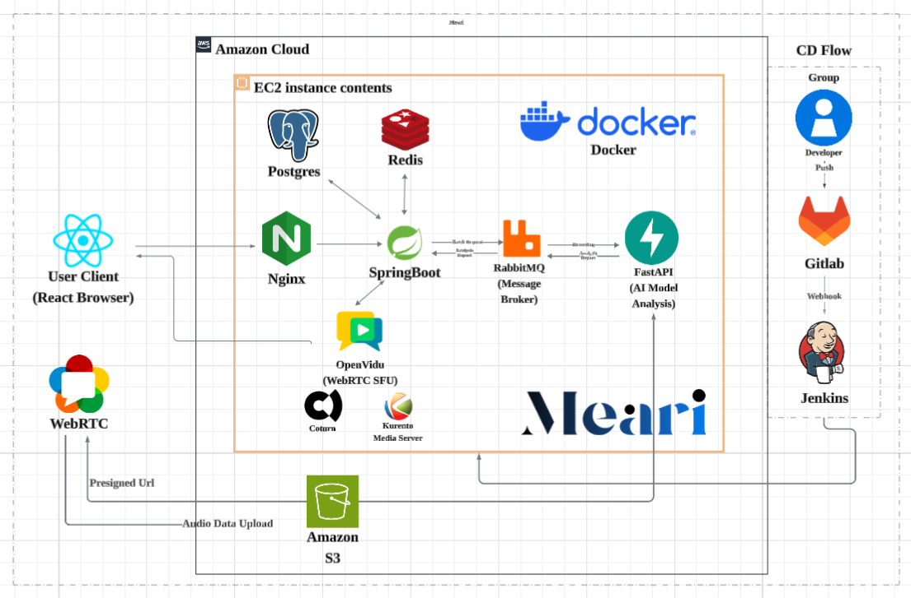


 
 

 
 

> # MEARI (硫붿븘由?
> ### ?륂뤌 肄섑뀗痢?湲곕컲 洹몃９ ?먮룄??醫낇빀 ?뚮옯??
>**MEARI**???댁＜誘쇱쓣 ?꾪븳 ?쒓뎅??留먰븯湲??곗뒿 ?뚮옯?쇱엯?덈떎.  
> ?앹깮???쒗쁽???닿릿 而⑦뀗痢좊? 移쒓뎄?ㅺ낵 ?④퍡 ?곌린?섎ʼn ?숈뒿?섎뒗  
> 利먭굅???숈뒿寃쏀뿕???쒓났?⑸땲??

 
 

---

## ?뱠 紐⑹감

  

**[?꾨줈?앺듃 媛쒖슂](#?꾨줈?앺듃-媛쒖슂)**

**[二쇱슂 湲곕뒫](#二쇱슂-湲곕뒫)**

**[湲곗닠 ?ㅽ깮](#-湲곗닠-?ㅽ깮)**

**[?쒖뒪???꾪궎?띿쿂](#?쒖뒪???꾪궎?띿쿂)**

**[ERD](#ERD)**

 
  
 

---

## ?뫁 ?€ 援ъ꽦
 

| ?대쫫  | ??븷              | ?대떦 湲곕뒫                               | GitHub                                              |
|-----|-----------------|-------------------------------------|-----------------------------------------------------|
| 源€?좎뿽 | Frontend        | ?꾨줈?앺듃 由щ뱶, ?€?쒕낫??諛?硫붿씤 湲곕뒫 湲고쉷 쨌 媛쒕컻       | [@shipleaf](https://github.com/shipleaf)            |
| 援????| Frontend        | ?몄쬆, 硫붿씤 湲곕뒫 湲고쉷 쨌 媛쒕컻                   | [@meanhg](https://github.com/meanhg)                |
| ?꾩꽍洹?| Backend / AI / Infra | CI/CD 諛??명봽?? AI ?뚯꽦 遺꾩꽍 濡쒖쭅, WebSocket 湲곕뒫 湲고쉷 쨌 媛쒕컻 | [@jsg9987](https://github.com/jsg9987)              |
| 源€?ъ닔 | Backend         | ?몄쬆/?뚯썝, WebSocket 湲곕뒫 湲고쉷 쨌 媛쒕컻         | [@kayaaaaaaaaaaa](https://github.com/kayaaaaaaaaaaa) |
| ?섏?吏€ | AI              | ?곗씠??愿€由? ?뚯꽦 遺꾩꽍 紐⑤뜽 ?뚯씤?쒕떇               | [@EunByu1](https://github.com/EunByu1)                     |
| ?μ긽誘?| Infra / Backend | CI/CD 諛??명봽?? WebRTC 湲곕뒫 湲고쉷 쨌 媛쒕컻            | [@thermoCat](https://github.com/thermoCat)          |

 
  
 

---

## ?뱞 ?꾨줈?앺듃 媛쒖슂
 

**MEARI**???댁＜誘쇱쓣 ?꾪븳 ?쒓뎅??留먰븯湲??곗뒿 ?뚮옯?쇱엯?덈떎.

**?꾩슂???곕씪 ?좏깮?섎뒗 ?ㅼ뼇??AI ?륂뤌 ?쒕씪留?*,  
**WebRTC 湲곕컲 ?ㅼ떆媛?洹몃９ ?먮룄??*,  
**?ㅼ뼇???곹솴???€泥섑븯??KOPIC**,  
**AI ?뚯꽦 遺꾩꽍???듯븳 ?숈뒿 由ы룷??*,  
**吏€?띿쟻???숈뒿???좊룄?섎뒗 ?쇱씪?숈뒿** 

?앹깮???쒗쁽???닿릿 而⑦뀗痢좊? 蹂닿퀬 移쒓뎄?ㅺ낵 ?④퍡 ?곌린?섎ʼn ?숈뒿?섎뒗  
利먭굅???숈뒿寃쏀뿕???쒓났?⑸땲?? 

 
 

 
 

### **1. 理쒕? 4????븷 湲곕컲 ?숈떆 ?먮룄?됱쑝濡??ㅼ젣 ?곹솴 ?쒕??덉씠??*
  - ?ㅼ씤 媛??€???곸긽??湲곕컲?쇰줈 ?곹솴怨?留λ씫, ?섏븰?ㅺ퉴吏€ ?숈뒿
  - ?ㅼ깮??湲곕컲 而⑦뀗痢?援ъ꽦?쇰줈, ?섏쓽 ?섍꼍怨??꾩슂??留욌뒗 而⑦뀗痢좊? ?좏깮?섏뿬 ?숈뒿

   

### **2. ?쒓컙怨??μ냼??援ъ븷諛쏆? ?딅뒗 ?먭꺽 洹몃９ ?숈뒿**
  - 嫄곗＜ 援??, 吏€?? ?쒓컙??愿€怨??놁씠 ?먰븷 ???몄젣???숈뒿???쒖옉?????덈뒗 ?ㅼ떆媛??ㅽ꽣?붾８
  - ?붿긽?듯솕?€ ?ㅼ떆媛?梨꾪똿?쇰줈,  ?먰솢???섏궗?뚰넻 媛€??

   

### **3. 二쇱뼱吏??곹솴???€???몄뼱???€泥섎뒫???됯? 諛??숈뒿 ?쒕퉬??肄뷀뵿**
- ?곹솴???곕Ⅸ 臾몃㎘怨??섏븰?? ?쒗쁽???곸젅?깆쓣 ?됯??섍퀬, 媛쒖꽑?먯쓣 ?꾩텧

   

### **4. AI 湲곕컲 諛쒖쓬, ?듭뼇, ?뺥솗?? ?댁슜 ?곸젅???쇰뱶諛?由ы룷??*
  - 湲곕뒫?? ?댁슜???쇰뱶諛깆쓣 ?쒓났?섎뒗 ?먮룄??由ы룷?몄? 肄뷀뵿 由ы룷??

   

### **5. ?댄쐶?€ 臾몃쾿??蹂댁땐?댁＜???쇱씪?숈뒿 怨쇱젣**
  - 諛쒗솕??湲곕컲???섎뒗 臾몃쾿怨??댄쐶??袁몄????숈뒿 ?낅젮

   

### **6. 湲곌컙蹂??숈뒿?듦퀎瑜??섑??대뒗 ?€?쒕낫??*
  - ?쇰퀎 ?숈뒿 湲곕줉 ?듯빀 ?듯빀 議고쉶濡??깆옣 怨쇱젙 ?뺤씤

 
  
 

---

## ?썱截?湲곗닠 ?ㅽ깮
 

### ?숋툘 Backend

### ?뾼截?Database & Infrastructure

### ?뵍 ?몄쬆 & 蹂댁븞

### ?쭬 AI & 誘몃뵒??

### ?뼢截?Frontend

### ?봺 ?뚯뒪??& 臾몄꽌??

### ?뵩 Environment

### ?뮠 Communication

   

 
 

---

## ?뮕 二쇱슂 湲곕뒫
 

### 1. ?뚯썝 媛€??諛??몄쬆
- JWT 湲곕컲 ?몄쬆 ?쒖뒪??(Access Token + Refresh Token)
- Spring Security瑜??듯븳 ?덉쟾???뚯썝 愿€由?
- Redis ?몄뀡 愿€由?諛?PostgreSQL ?곗씠???€??

### 2. ?ㅼ떆媛??묐젰 ?숈뒿 (洹몃９ ?€?꾩엵)
- OpenVidu 2.30.0 湲곕컲 WebRTC 理쒕? 4???붿긽 ?듯솕
- STOMP WebSocket?쇰줈 ?ㅼ떆媛???븷 ?좏깮, 以€鍮??곹깭, 梨꾪똿 ?숆린??
- ?쇱슫?쒕퀎 ?뱁솕 諛?寃뚯엫 吏꾪뻾 ?곹깭 愿€由?(WAITING ??WATCHING ??ROLE_PICK ??ROUND_1 ??ROUND_2)
- ?뚮쭏蹂?諛??앹꽦 諛?鍮좊Ⅸ ?낆옣 (怨듦컻諛?鍮꾨?諛?
- FFmpeg瑜??댁슜???숈쁺??泥섎━ 諛?AWS S3 ?€??

### 3. ?쇱옄 ?곗뒿 紐⑤뱶
- ?ㅻⅨ ?щ엺 ?놁씠 ?쇱옄???€?꾩엵 ?곗뒿 媛€??
- ?먰븯??肄섑뀗痢좎? ??븷 ?먯쑀 ?좏깮
- ?쇱슫?쒕퀎 ?뱀쓬 諛??뚯꽦 遺꾩꽍 ?붿껌

### 4. ?€?꾩엵 肄섑뀗痢?愿€由?
- ?뚮쭏蹂?肄섑뀗痢?愿€由?(?쒕씪留? ?곹솕 ???ㅼ깮??湲곕컲)
- 臾몄옣 ?⑥쐞 ?숈뒿: ?쒓뎅??踰좏듃?⑥뼱 踰덉뿭, ?€?대컢 ?뺣낫, ??븷(Role) ?좊떦
- 理쒕? 4媛???븷 吏€??

### 5. AI 湲곕컲 ?뚯꽦 遺꾩꽍 (鍮꾨룞湲?
- RabbitMQ 湲곕컲 鍮꾨룞湲?泥섎━ (Producer/Consumer ?⑦꽩)
- FastAPI + Wav2Vec2 湲곕컲 諛쒖쓬 ?뺥솗??遺꾩꽍 (0~100??
- Parselmouth + DTW 湲곕컲 ?듭뼇 ?좎궗??遺꾩꽍 (0~100??
- ?뚯젅 ?⑥쐞 ?곸꽭 ?쇰뱶諛?(?ㅻ쪟 ?꾩튂, ?좏삎, ?좊ː??
- S3 ?먮룞 ?ㅻ뵒???ㅼ슫濡쒕뱶 諛?寃곌낵 PostgreSQL ?€??

### 6. KOPIC ?몄뼱 ?됯? ?쒖뒪??
- Gemini 2.5-flash 湲곕컲 ?곹솴蹂??몄뼱 ?€泥??λ젰 ?됯?
- 5媛?臾명빆 ?쒕뜡 異쒖젣 (30珥??€?대㉧)
- 臾몃㎘, ?섏븰?? ?쒗쁽 ?곸젅??醫낇빀 ?됯?
- 媛쒕퀎 臾명빆 ?됯? + ?듯빀 由ы룷???앹꽦

### 7. ?숈뒿 由ы룷??
- **?€?꾩엵 由ы룷??*: ?쇱슫?쒕퀎 ?뺥솗?? ?듭뼇, ?뚯젅蹂??곸꽭 遺꾩꽍 (JSONB)
- **KOPIC 由ы룷??*: 臾명빆蹂??먯닔, AI ?쇰뱶諛? 醫낇빀 ?됯?
- 而ㅼ꽌 湲곕컲 ?섏씠吏?諛??좎쭨蹂??꾪꽣留?
- Recharts 湲곕컲 李⑦듃 ?쒓컖??

### 8. ?숈뒿 ?€?쒕낫??
- ?쇱씪 ?숈뒿 湲곕줉 (GitHub ?붾뵒 ?뺤떇 ?덊듃留?
- 理쒓렐 ?쒕룞 ?쇰뱶 (?€?꾩엵, KOPIC, ?쇱씪 ?숈뒿 ?듯빀)
- ?됯퇏 ?뺥솗???듭뼇 ?먯닔 異붿씠 洹몃옒??
- Recharts + Framer Motion ?좊땲硫붿씠??

### 9. ?쇱씪 ?숈뒿
- **?⑥뼱 ?숈뒿**: ?쒕뜡 ?⑥뼱 10臾명빆 (?ㅼ??좊떎??
- **臾몄옣 ?쒖꽌 留욎텛湲?*: ?쒕옒洹????쒕∼ ?댁쫰
- ?꾨즺 ???€?쒕낫??湲곕줉
 
  
 

---

## ?뾻截??쒖뒪???꾪궎?띿쿂

 

 

 
 

---

## ?뿺截?ERD

 

 
  
 

---

 

### ?쇱씠?쇱뒪

 
SSAFY(?쇱꽦 泥?뀈 ?뚰봽?몄썾???꾩뭅?곕?) 14湲?怨듯넻 ?꾨줈?앺듃

**C207 Meari**

 
 

---

**留덉?留??낅뜲?댄듃**: 2026-02-22 
